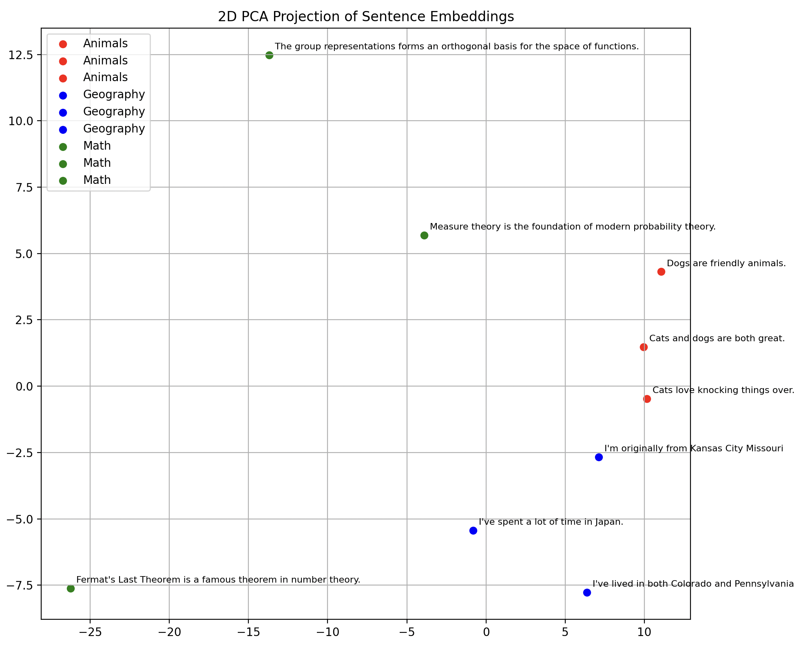

# Fetch Exercises : Sentence Transformers and Multi-Task Learning

**Adam Henderson**

**2025-01-30**

# Step 0 : Setup


# Step 1 : Sentence Transformer Model : 

## Choices : 

**Framework : Pytorch + Huggingface** 
    
  * These have friendly interface's, wide adoption, and sufficient documentation.

**Model Architecture : BERT-Like Encoder only model.**

  * Knowing that Step 2 is Multi-Task targeting sentence and token level classification, I'll use a BERT-Like Encoder only model providing sentence level and token level embeddings that can be used for both classification tasks.
  * I'll use a masked language modeling task for pretraining. 
  * I'll use a smaller model size for faster training and quick iteration.

**From Model to Embedding :**

  * I'll use the mean of the last hidden states as the sentence embedding.
  * Without fine-tuning to give meaning to the [CLS] token it is not a useful embedding.

**For pretraining, embedding, and future multi-task use the model is split into two parts**

  * Base Model : Returns the last hidden state with `get_encoder_output`
  * Heads like the Masked Language Modeling Head used for pretraining or Sentence Embedding Head used to generate sentence embeddings.
  * These two are combined in `TransformerWithHeads`.

     For example for pretraining
     
     ```python
        model = TransformerWithHeads(config)
        model.add_head("mlm", MaskedLanguageModelingHead(config))
     ```

Training is run via : 
```train
python3 pretrain.py
# writes model to ./base-transformer
```

I did not optimize training - choosing default for learning rate, epochs, batch size, etc.

## Examples

2-D project of some example sentences and their embeddings : 



The embeddings are not excellent - but they capture some semantic similarity as we can see from 
decent clustering of sentences of similar theme.  
 
Cosine similarities between some embeddings :

Similarity between:
'Cats love knocking things over.'
and
'Dogs are friendly animals.':
0.8874

Similarity between:
'Cats love knocking things over.'
and
'I've lived in both Colorado and Pennsylvania':
0.7837

Similarity between:
'Cats love knocking things over.'
and
'The group representations forms an orthogonal basis for the space of functions.':
0.4018

Similarity between:
'Cats love knocking things over.'
and
'Fermat's Last Theorem is a famous theorem in number theory.':
0.1000

# Step 2 : Multi-Task Learning : 

## Tasks : 

1. Sentence Classification : Saw a fun "Arxiv" dataset classifying title and abstracts into categories.

2. Token Classification : "Science-IE" dataset classifying tokens into categories like material, process, task.

```python
# Can see a sample of the task specific data
python3 finetuning_data.py
```

## Changes to Architecture to Support Multi-Task Learning

This was previewed in Step 1. The original code assumed the mlm head was the only head and I manually extracted the last hidden state. 
For both pretraining only and for multi-task learning it is valuable to split up the base model and the various heads.

The structure of the model is now : 

* `TransformerWithHeads` : A class that composes the base model with multiple heads where a single Head takes as input the last hidden state and returns a loss and head output.

* Heads : For the multi-task example we have heads
  * `SentenceClassificationHead`
  * `TokenClassificationHead`

These are registered in the `TransformerWithHeads` class by
```python
    model = TransformerWithHeads.from_pretrained("./base_transformer")
    model.add_head("classification", 
                   SentenceClassificationHead(config, num_sentence_labels))
    model.add_head("token_classification", 
                   TokenClassificationHead(config, num_token_labels))
```

For inference
```python
# without specifying a single head - we'll get outputs from all heads.
model.forward(input_ids)

# specifying a single head will return the loss, output from that head
model.forward(input_ids, head="classification")
```

# Step 3 : Discussions 

## 1. On deciding what to train and what to keep frozen.

**Frozen Base Model + Independently Trained Heads** : Keep the pretrained base transformer frozen and train each head on its own training data. This is my preference when possible.

 - **When** : If we have sufficient data for each task to train the independent heads to the desired precision this is ideal.
 - **Pros** : This is computationally efficient and guarantees that there is no cross-task interference where training on one task negatively impacts the other. We also don't need to worry about defining a joint loss / balancing learning between the tasks.
 - **Cons** : There is no transfer learning between tasks, and there is a risk that the features learned by the base model leave out valuable information for the tasks. Both these would reduce the precision of the tasks.

**Fine Tuned Base Model + Independently Trained Heads** : Jointly fine tune the base model on both tasks while training heads on their own data.

  - **When** : There is insufficient data to train independent heads to the desired precision in one or more heads, an expectation that the tasks are compatible, and possible value in the sentence level embeddings being better informed by supervised training.
  - **How Much to Unfreeze?** : We can gradually unfreeze layers of the base model starting from the top until the tasks are trained to the desired precision as measured using the validation data.
  - **Pros** : This can improve precision on both tasks.
  - **Cons** : There is higher complexity during training from the need to define a joint loss function and training schedule. The two tasks are now coupled such that changes to one may impact the other.

## 2. Multi-Task vs. Completely Separate Models : 

The criteria that I would use to decide are mostly informed by the degree of task compatibility. The more compatible tasks are - the more the parameter count of the multi-task models will be signficantly lower than individual models.

That task compatibility drives the criteria I really care about : 

- Maintainability of the codebase, monitoring, and operations : Higher compatiblity will enable more code reuse and common knowledge of working with the backbone model.
- Training and inference cost : Reduced training cost of fine-tuning or training only heads and an ability to optimize inference of the backbone.
- Iteration speed for the models : We'll see fewer parameters / layers needed to train.

When the Multi-Task model leads to a more maintainable model that enables teams to iterate quickly and ship improvements I'll prefer it!

## 3. Strategy for imbalanced data : Assume that Task A has abundant data while Task B has limited data.

For example assume that Task A has 10x the data of Task B. This is likely a scenario where attempting to train an independent head for Task B will not produce the desired precision.

There is an increasing complexity of strategies to consider : 

1. Loss Weighting : Choose a weighted combination of the individual losses - loss = `w_A *loss_A + w_B * loss_B`. This would require tuning of the weights starting at `w_A = 1 and w_B = 10` - assuming the losses are similarly scales.

The next two - I would need to refresh my memory on :

2. Dynamic Loss Weighting : A more complex strategy is dynamically adjusting the weights for example by GradNorm (GradNorm: Gradient Normalization for Adaptive
Loss Balancing in Deep Multitask Networks).

3. Mixture of Experts : Yet more complex would be adopting a Mixture of Experts architecture to split the shared base model into multiple experts and learning the extent to which the tasks are compatible. 